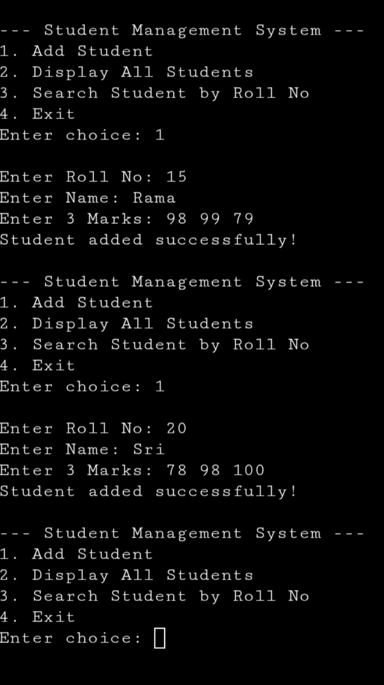
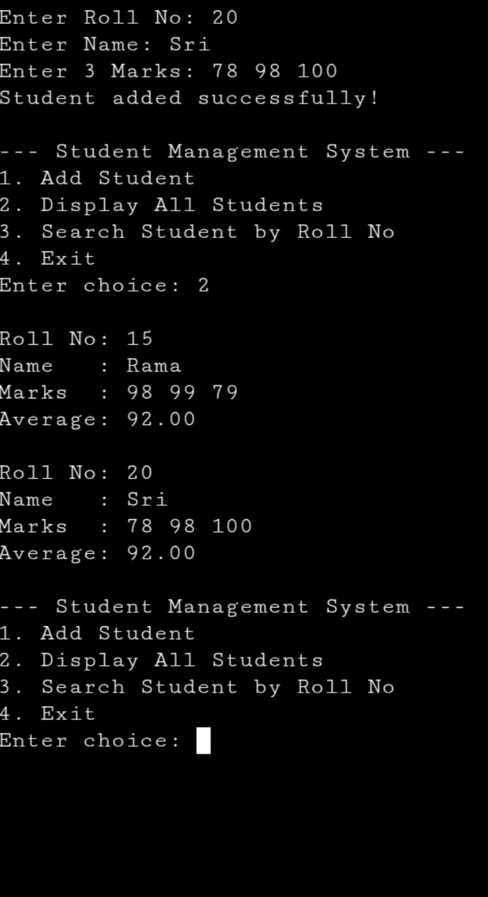
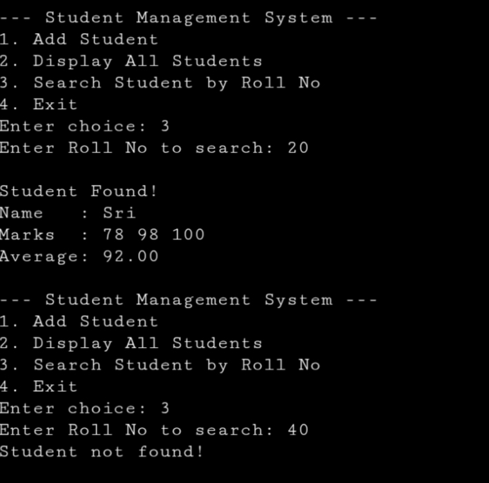
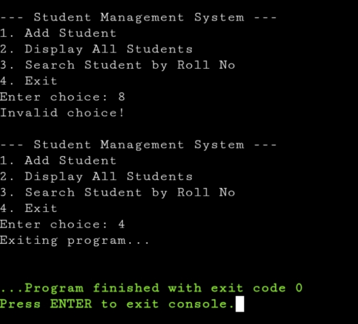

# Student Management System (C)
A simple, menu-driven Student Management System developed in C.
This project manages student records using structures, arrays of structures, and functions, with support for student names containing spaces.

## 📌 Features
• Add student details
- Roll number
- Full name (spaces allowed)
- Marks in three subjects
  
• Display all student records

• Search student by roll number

• Automatic average marks calculation

• Easy-to-use console menu

## 🧠 Concepts Used
- Structures in C
- Array of structures
- Functions with structure parameters
- Menu-driven programming
- Runtime input handling

## 🛠️ Program Flow
1. Display menu options
2. Accept user choice
3. Perform selected operation
4. Continue until exit
   
## ▶️ How to Compile and Run

Compile: gcc structure.c -o structure

Run: ./structure 

## 📸 Output 
1. Adding Students 

2. Displaying Students 

3. Searching Students 

4. Exit Program 

## ⚠️ Limitations

- Maximum of 50 students
- Console-based interface
- No file storage (data is lost after exit)
- No duplicate roll number check
- Basic input validation

  
## 🚀 Future Enhancements
- File handling for permanent storage
- Edit and delete student records
- Sorting and grading system
- Improved validation and error handling
- Enhanced user interface

## ➕ Possible Add-Ons
- Admin login system
- Export data to files
- Pass/fail analysis
- Colored console output

 ## 👩🏻‍💻Author
Name: Shravani Thouta 

Course: C Programming
